# Payment Gateway Backoffice Automation Suite (Backend)
Backoffice Application Automation for extracting Payment Information, using Python and Selenium

   - ## Dependencies
      1. Python 3 (Windows Installation)
      2. VSCode
      3. requirements.txt (libraries Installation using PIP)
      4. Excel
      5. Command Prompt Or Powershell (For Execution)

   - ## Environment
      1. Windows 11 Enterprise
      2. Google Chrome

   - ## Objective
      1. Application facilitates automated fetching of Payment information of individual order IDs, batch IDs with different payment statuses in a database during events such as RDS failure or other payment failures. 
      2. The code utilizes the PG Backoffice Application and the Selenium browser automation tool to emulate user actions and download CSV files for each order ID provided in a list. These individual CSV files are then merged into a consolidated output list and saved to a specified path. 
      3. Also this code utilizes the PG Backoffice Application and the Selenium browser automation tool to emulate user actions and download CSV files for each batch ID provided in a list 
      4. By automating these actions, the tool eliminates the need for manual intervention and streamlines the entire process from start to end.

   - ## Prerequisites
      
      1. While running the script, It opens the application site and if site is asking the login credentials give those and wait for script to be completed. Once done, 're-run the script again' it will work. (Note: We can use One terminal for: `oi` and another terminal for: `bi` for both of them follow this step 1)

         - ### Check below for order-input(oi),

            <div align="center">
                  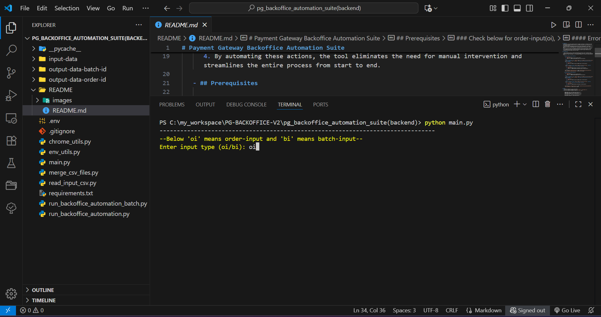
                  
            </div>

            - #### Error handling, if user `haven't logged in (or) logged-in first time after session expired`, wait for script to be completed then browser will close and we will see the output like below,

               <div align="center">
                     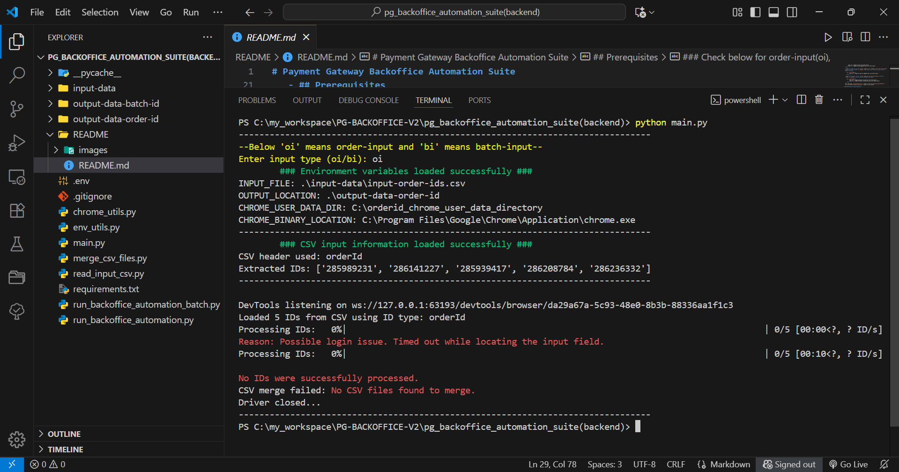
               </div>

            - #### Error handling, if user `haven't logged in and close the browser`, wait for script to be completed then we will see the output like below,

               <div align="center">
                     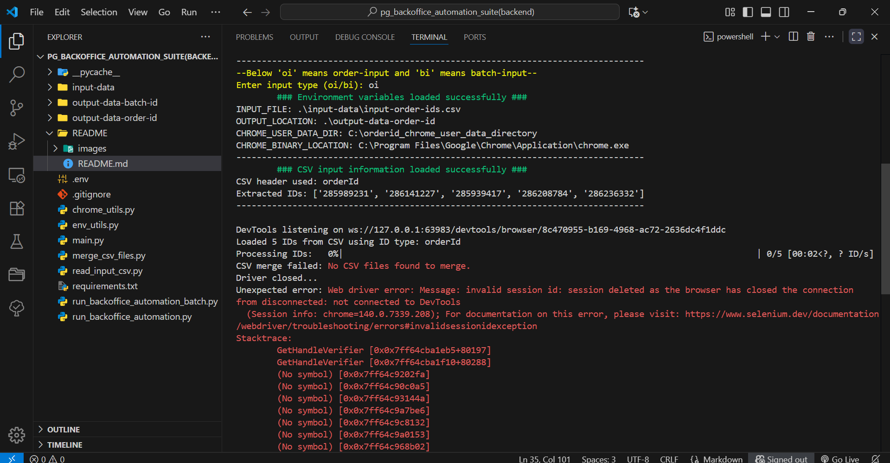
                     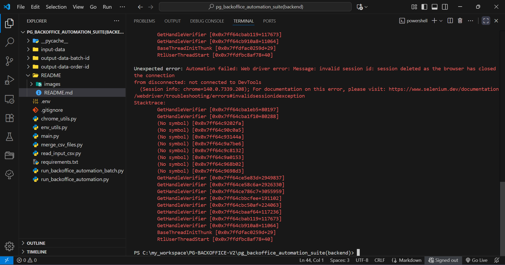
               </div>

         Note: But under `output-data-order-id` a empty `Backoffice-orderids-data-DD-MM-YYYY-(At-time-HH-MM-SS)\merge-output-data\` folder will be created
            
         - ### Check below for batch-input(bi),

            <div align="center">
                  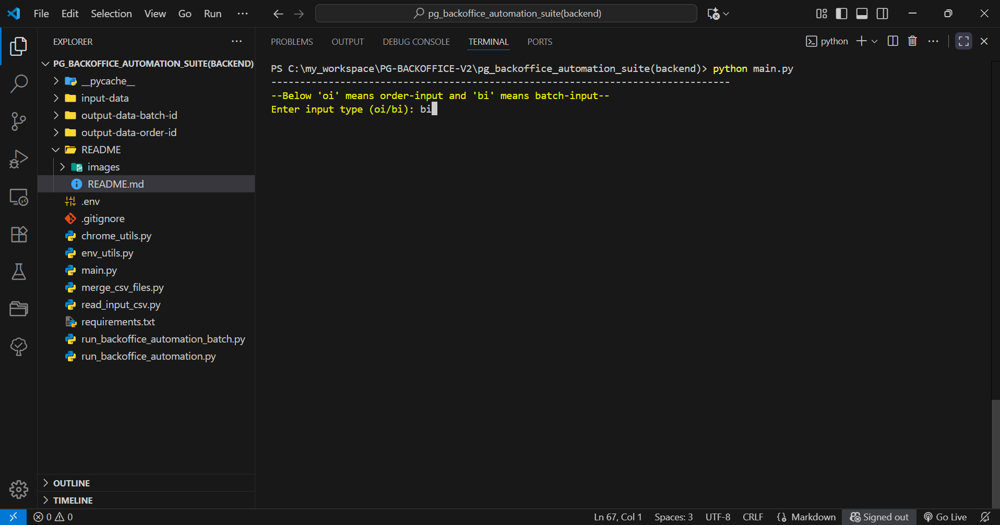
                  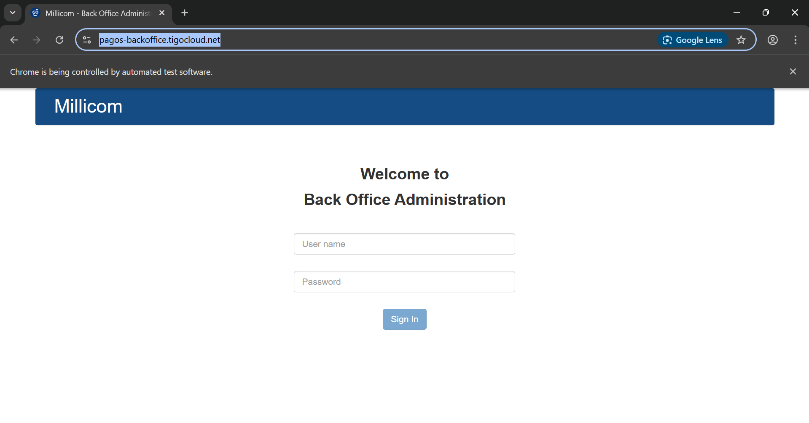
            </div>

            - #### Error handling, if user `haven't logged in (or) logged-in first time after session expired`, wait for script to be completed then browser will close and we will see the output like below,

               <div align="center">
                     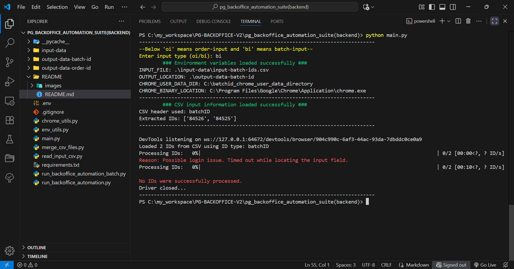
               </div>

            - #### Error handling, if user `haven't logged in and close the browser`, wait for script to be completed  then we will see the output like below,

               <div align="center">
                     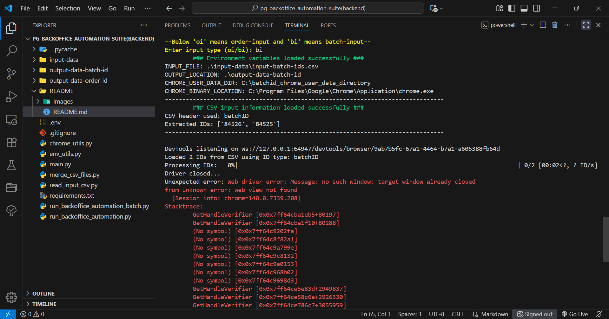
                     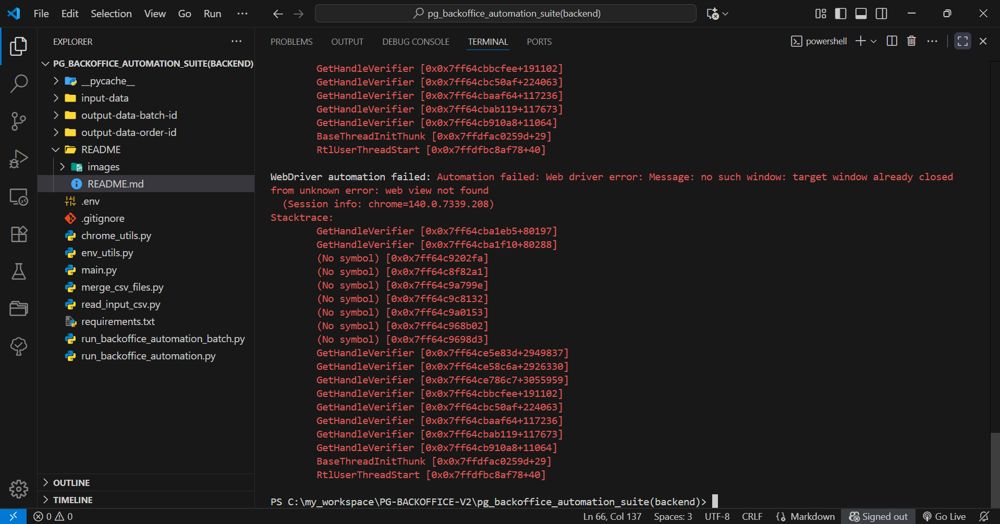
               </div>

         Note: But under `output-data-batch-id` a empty `Backoffice-batchids-data-DD-MM-YYYY-(At-time-HH-MM-SS)\` folder will be created


   - ## Usage
      1. Clone this repository to your local machine.
      2. Install the necessary dependencies using `pip install -r requirements.txt`.
      3. Set up the required environment variables in a `.env` file:

         ```
            ORDER_INPUT_FILE=".\\input-data\\input-order-ids.csv"
            ORDER_OUTPUT_LOCATION=".\\output-data-order-id"
            ORDER_CHROME_USER_DATA_DIR="C:\\orderid_chrome_user_data_directory"

            BATCH_INPUT_FILE=".\\input-data\\input-batch-ids.csv"
            BATCH_OUTPUT_LOCATION=".\\output-data-batch-id"
            BATCH_CHROME_USER_DATA_DIR="C:\\batchid_chrome_user_data_directory"

            CHROME_BINARY_LOCATION="C:\\Program Files\\Google\\Chrome\\Application\\chrome.exe"

         ```
         Replace the paths with your actual paths as needed if you want.

      4. Run the script `main.py` using `python main.py` in the terminal.

         - ### order-input(oi)
            1. The script will navigate to the backoffice application and start fetching payment information for the order IDs specified in the `input-data/input-order-ids.csv` file.
            2. The `input-order-ids.csv` file includes data with a single column and a header. Please ensure that the header is either `orderId` or `transactionId`, as the data under that header will be processed accordingly.
            3. The downloaded CSV files will be saved to the `\output-data-order-id\Backoffice-orderids-data-DD-MM-YYYY-(At-time-HH-MM-SS)\` folder. Once all CSV files are downloaded, they will be merged into a single CSV file named `\Backoffice-orderids-data-DD-MM-YYYY-(At-time-HH-MM-SS)\merge-output-data\` in the same output folder.
            4. If `input order IDs are perfect` then,

               <div align="center">
                  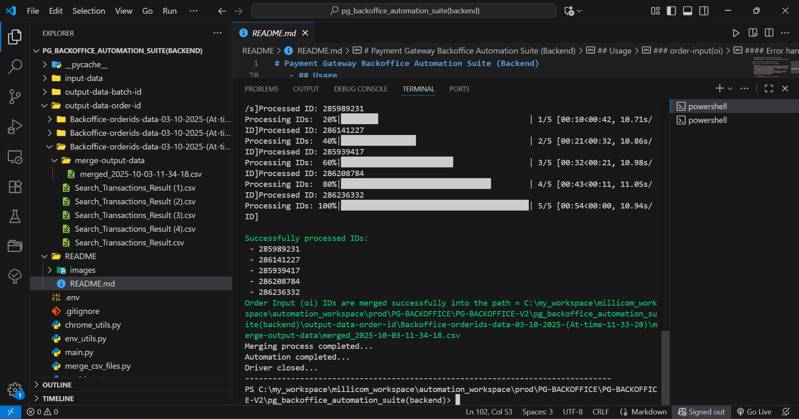
               </div>

            - #### Error handling,
               - If `No order IDs` are present then,

                  <div align="center">
                     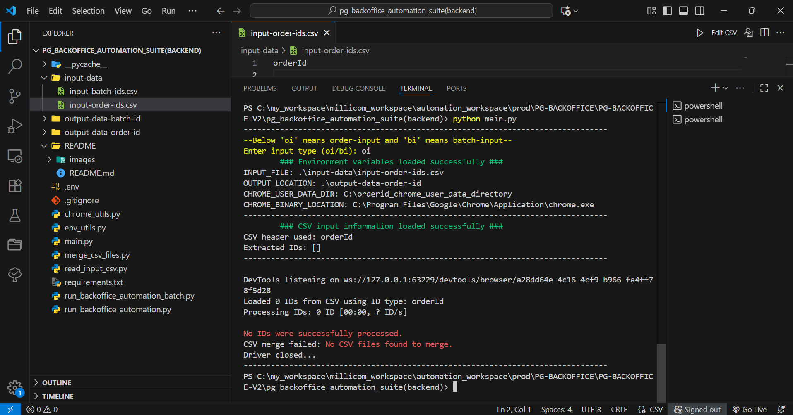
                  </div>

               - If Nothing is there in `input-order-ids.csv`..like empty file then,
                  <div align="center">
                     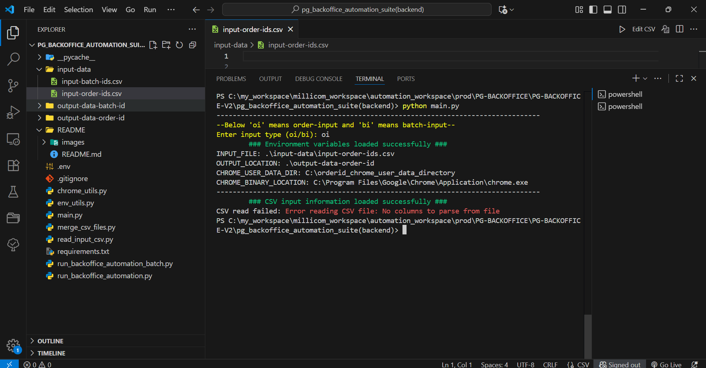
                  </div>

               - If `any ID is invalid` then It stops the further processing of IDs and it only merges the processed IDs.
                  <div align="center">
                     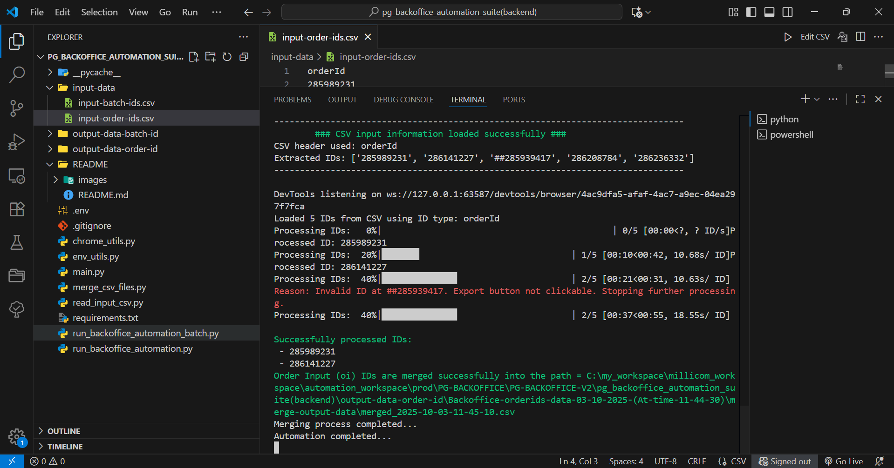
                  </div>


         - ### batch-input(bi)
            1. The script will navigate to the backoffice application and start fetching payment information for the batch IDs specified in the `input-data/input-batch-ids.csv` file.
            2. The `input-batch-ids.csv` file includes data with a single column and a header. Please ensure that the header is `batchId` `, as the data under that header will be processed accordingly.
            3. The downloaded CSV files will be saved to the `\output-data-batch-id\Backoffice-batchids-data-DD-MM-YYYY-(At-time-HH-MM-SS)\` folder.
            4. If `input batch IDs are perfect` then,

               <div align="center">
                  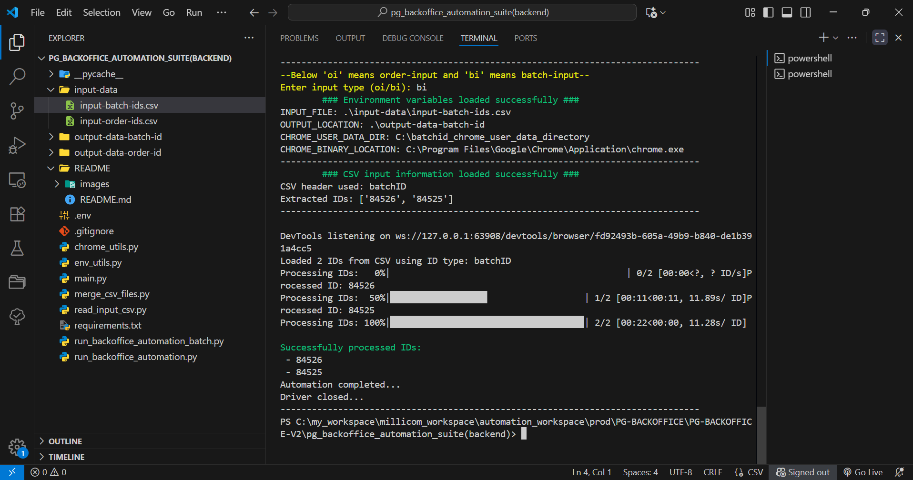
               </div>

            - #### Error handling,

               - If `No batch IDs` are present then,
                  <div align="center">
                     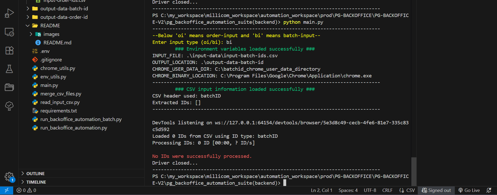
                  </div>

               - If Nothing is there in `input-batch-ids.csv`..like empty file then,
                  <div align="center">
                     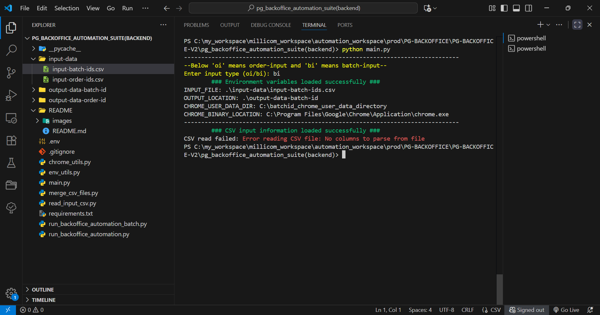
                  </div>
               - If `any ID is invalid` then It stops the further processing of IDs.
                  <div align="center">
                     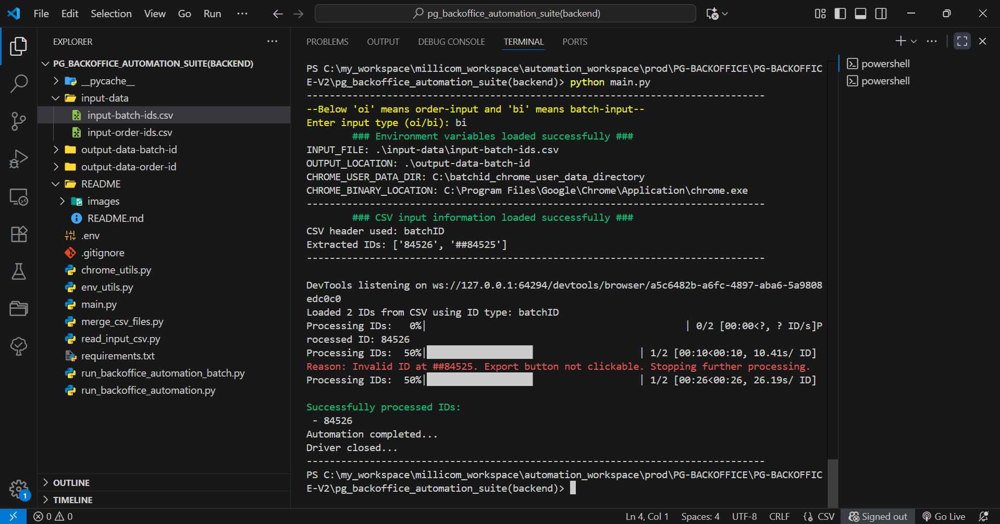
                  </div>

      - ### Note: if `any modification or changes` are done in the script, then you should `re-run` the script to effect the changes

   
   - ## Common Error Handling
      
      - ### Handling invalid input given then
        1. If user given wrong input,
           <div align="center">
                  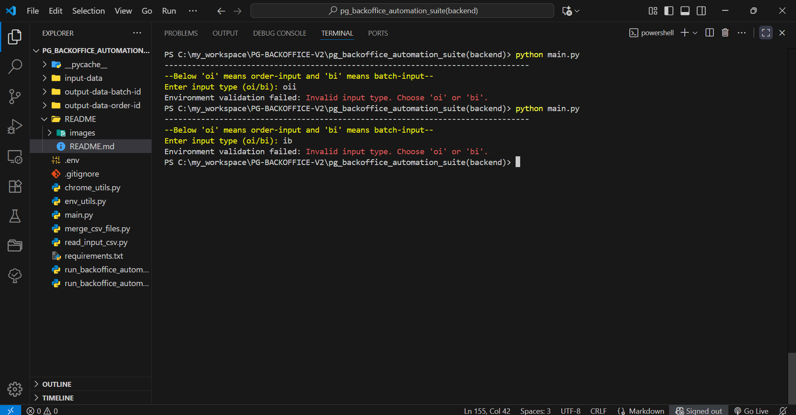
           </div>

      - ### Handling .env variable errors
        1. In .env, if any variable had names are modified or missed otherthan `CHROME_BINARY_LOCATION` variable, then
           <div align="center">
                  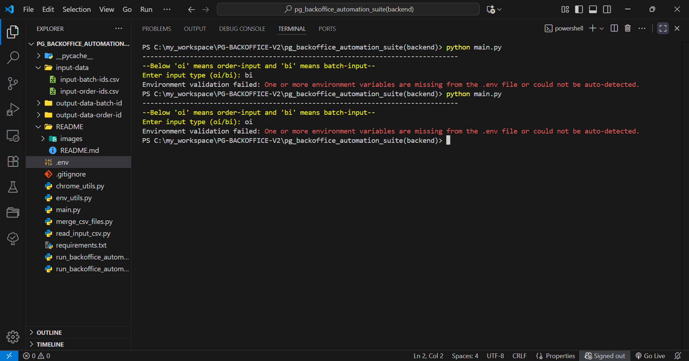
            </div>

        2. In .env,  `ORDER_INPUT_FILE` and `BATCH_INPUT_FILE` paths are incorrect then
           <div align="center">
                  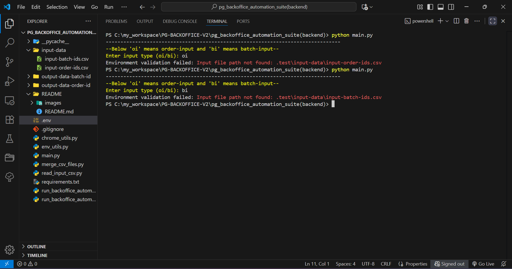
            </div>

        3. In .env, `CHROME_BINARY_LOCATION` path is incorrect then
            <div align="center">
                  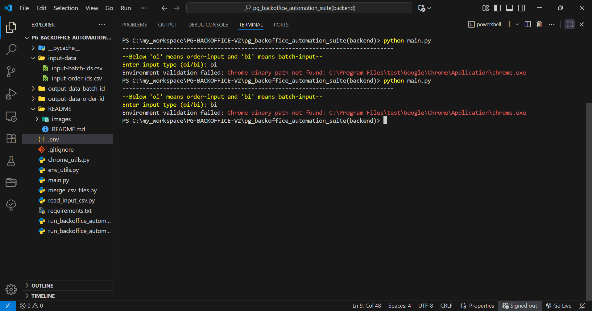
            </div>

      - ### Input data columns are different names then,
        1. In `input-order-ids.csv` and `input-batch-ids.csv` column names are different,
           <div align="center">
                  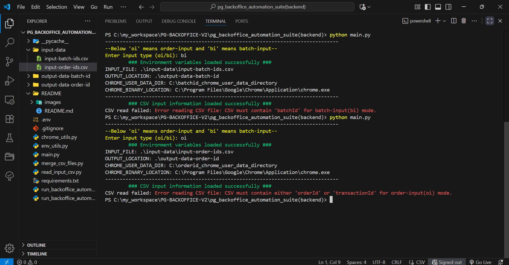
            </div>

      - ### Dependency Errors
         - During Chrome Version Upgrades, Selenium library might lose its compatibility with chrome drivers. It will throw exceptions Like Error Message: Session not created: This Version of Chromedriver only supports Chrome Version. During Such Instances, use below command to Upgrade packages `pip install --upgrade -r requirements.txt`


   - ## Contributing
      - If you find any issues or have suggestions for improvements, feel free to open an issue or submit a pull request. Your contributions are welcome and highly appreciated!